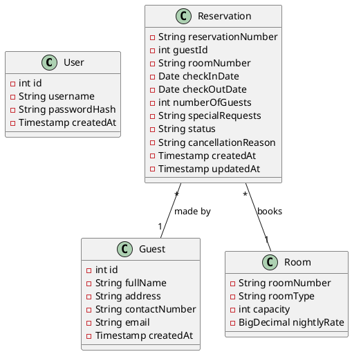

# Ocean View Resort - Class Diagram

A Class Diagram is a structural UML diagram utilized in object-oriented framework designs to map out the system's classes, their specific attributes, operational methods, and the relationships connecting those objects together. It operates essentially as the blueprint for the application's data layer (models/POJOs). A class diagram is instrumental when transitioning from conceptual design to actual coding, informing developers exactly which variables belong to which object scopes in the backend.

This diagram displays the four core domain models of the Java backend: `User`, `Guest`, `Room`, and `Reservation`. It showcases their private data members, ensuring encapsulation. It clearly highlights how the `Reservation` class acts as an associate class logically bridging a singular `Guest` to a singular `Room` at any given time. The one-to-many multiplicities are noted showing that while a guest can have multiple distinct reservations over time, a reservation links exactly backward to one `Guest` and one `Room`.

The design decision made here directly mirrors the relational database structure, simplifying the Object-Relational Mapping (ORM) cognitive load. Because Java is highly object-oriented and the assignment specifies plain JDBC (not Hibernate), mapping POJOs exactly 1:1 to database tables reduces mapping complexity within Data Access Objects (DAOs). Methods (like getters/setters) were intentionally omitted from the diagram visualization to keep the diagram clean and focused strictly on describing state and structure.
