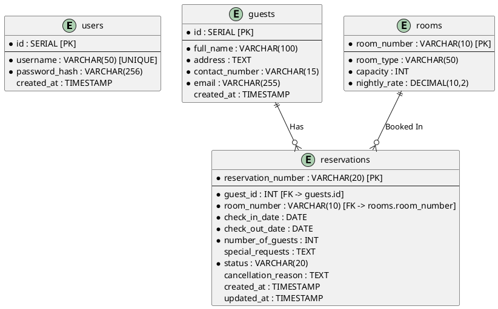

# Ocean View Resort - Entity Relationship Diagram (ERD)

An Entity Relationship Diagram (ERD) is a structural diagram used exclusively in database design to illustrate logical structures of databases. It visualizes the tables (entities) required to store the application's data, the specific columns and constraints housed inside them, and fundamentally maps how they link together using primary keys (PK) and foreign keys (FK). The ERD acts as the ultimate truth for a relational database's schema, determining how normalization rules are applied.

In this layout, we map the four foundational PostgreSQL tables mapping to the instruction's schema requirements. The `reservations` table serves as the central node of the entire ecosystem. It uses `VARCHAR` string formats for internal identifying structures (`RES-XXXXX` logic for reservations, short alphanumeric codes for rooms) and standard auto-incrementing `SERIAL` structures for `guests` and `users`. It establishes non-identifying relationships where one guest can own multiple reservation rows concurrently, and a room can be associated independently with multiple historical reservations.

A prominent design decision reflects data normalization. Instead of hardcoding guest info directly inside the reservations layout, we extracted `guests` into its own table and linked it via a foreign key (`guest_id`). This eliminates redundant storage if the same guest visits multiple times recursively. Furthermore, storing fixed pricing constraints (`nightly_rate`) physically in the `rooms` table rather than calculating them dynamically prevents historical invoices from fluctuating if the hotel universally updates its rates later, preserving necessary financial audit trails.
