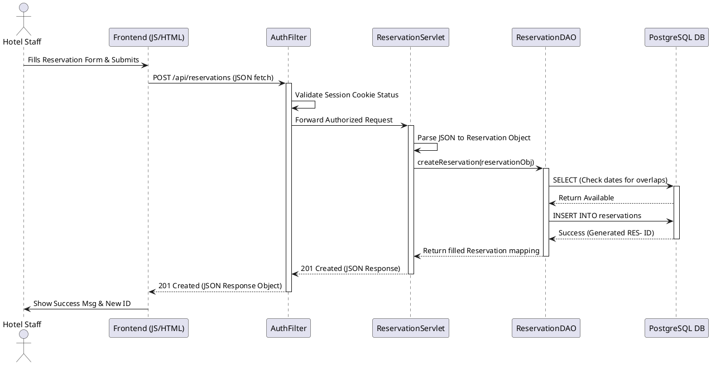

# Ocean View Resort - Sequence Diagram

A Sequence Diagram is an interaction UML diagram that focuses on the chronological progression of messages passed between system components. It details the step-by-step control flow and data transitions across the timeline of a specific scenario or use case. These diagrams are critical for understanding how different tiers of an architecture (frontend, controllers, services, databases) synchronize to fulfill a user request, helping uncover potential bottlenecks or logical gaps in complex workflows before they are built.

This diagram visualizes the "Add New Reservation" process. It spans the entire application stack horizontally from the actor (`Hotel Staff`) to the final persistent storage node (`PostgreSQL DB`). It maps the flow of a staff member submitting a frontend form: the execution trickles through the vanilla JavaScript `fetch` handler, is intercepted by the Java `AuthFilter` to verify session status, progresses to the `ReservationServlet` for JSON extraction, flows down to the `ReservationDAO` layer, and executes a two-stage SQL interaction (SELECT verification then INSERT) against the actual database before successfully returning up the chain. 

The sequence clearly demonstrates a deliberate design decision segregating responsibilities. Instead of embedding SQL securely within the servlet, we isolate data interactions into a `DAO` (Data Access Object) tier. Furthermore, an `AuthFilter` intercepts the request initially instead of placing session-checking logic inside the servlet directly. This promotes the DRY (Don't Repeat Yourself) principle and adheres to the Model-View-Controller (MVC) API paradigm outlined in the project instructions, ensuring a clean separation of concerns and a highly visible security perimeter.
