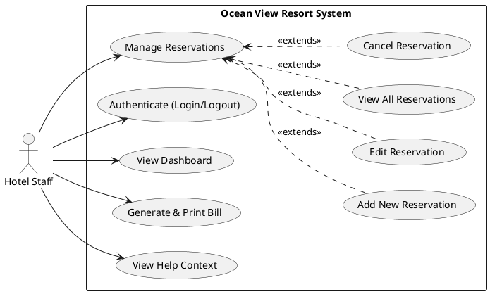

# Ocean View Resort - Use Case Diagram

A Use Case Diagram is a behavioral overview in the Unified Modeling Language (UML) that visually represents the interactions between users (actors) and an overarching system. It helps stake holders quickly grasp the primary functions the system performs without diving into technical specifics, focusing entirely on "what" the system does rather than "how" it does it. This diagram is crucial for confirming requirements and scope with non-technical stakeholders like hotel management.

This specific diagram illustrates the interactions of the single primary actor (`Hotel Staff`) with the `Ocean View Resort System` boundary. The staff member has access to several primary use cases such as Authentication, Viewing the Dashboard, Managing Reservations, Generating Bills, and Accessing the Help Menu. The Management of Reservations use case is further broken down using `<<extends>>` relationships to show optional or specific sub-actions: Adding, Editing, Viewing, and Cancelling reservations, which keeps the root tree clean while detailing the comprehensive reservation lifecycle.

The design decision here focuses on simplicity and role constraint. The system was designed strictly for internal hotel staff operation rather than public self-service. Therefore, there is no "Guest" actor interacting with the web interface. We grouped robust features like Add/Edit/Cancel underneath a single "Manage Reservations" umbrella because these functionalities share the same backend routing and validation architectures logically, making the diagram both concise and directly mapped to the software's navigation structure.
